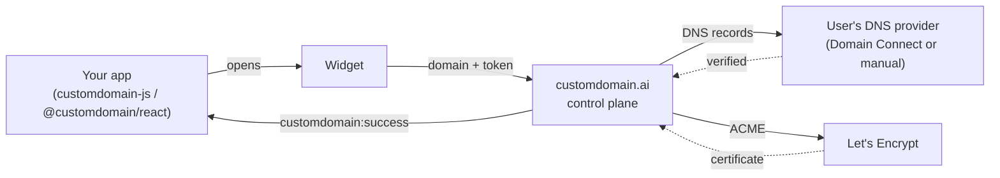

<h1 align="center">customdomain-sdk</h1>

<p align="center">
  Let your users bring their own domain — <code>acme.com</code> instead of <code>acme.yourapp.com</code> —
  without writing a line of DNS.
</p>

<p align="center">
  <a href="https://www.npmjs.com/package/customdomain-js"></a>
  <a href="https://github.com/CUSTOM-DOMAIN-APP/customdomain-sdk/actions/workflows/ci.yml"></a>
  <a href="LICENSE"></a>
</p>

<p align="center">
  <picture>
    <source media="(prefers-color-scheme: dark)" srcset="docs/assets/hero-dark.svg">
    
  </picture>
</p>

## Why this exists

Custom domains are one of the highest-leverage features a SaaS product can ship — they're
what turns "powered by [you]" into the customer's own brand. They're also a swamp: ~50 DNS
providers with incompatible record types, apex domains that can't hold a `CNAME` (RFC 1034),
ACME certificate issuance, propagation delays, and a support queue full of "it says pending."

`customdomain-sdk` is the client side of **[customdomain.ai](https://customdomain.ai)** — drop
a widget into your settings page, and your users connect a domain the way they'd connect a
payment method: paste it, follow three copy-paste DNS steps (or none, for the ~30 registrars
we can configure automatically via [Domain Connect](https://www.domainconnect.org)), done.
DNS verification, SSL issuance, and renewal happen behind the scenes.

## What's in this repo

| Package | npm | What it is |
|---|---|---|
| [`packages/sdk`](packages/sdk) | [`customdomain-js`](https://www.npmjs.com/package/customdomain-js) | The browser SDK — `window.customdomain`, opens the widget, streams connect events. Framework-agnostic. |
| [`packages/react`](packages/react) | [`@customdomain/react`](https://www.npmjs.com/package/@customdomain/react) | A thin React wrapper — hooks and components around the SDK. |
| [`packages/widget`](packages/widget) | `@customdomain/widget` *(private)* | The embeddable widget UI itself. Builds to the bundle the SDK loads; not published to npm — served hosted so it's always current. |

## Quickstart

```html
<!-- Hosted (recommended): always current, zero build step -->
<script src="https://app.customdomain.ai/widget-assets/customdomain-sdk.js"></script>
```

```sh
npm install customdomain-js          # or: npm install @customdomain/react
```

```js
window.customdomain.open({
  applicationId: "app_123",
  token: TOKEN_FROM_YOUR_SERVER, // minted server-side — never ship your API key to the browser
});

window.addEventListener("customdomain:success", (e) => {
  console.log("connected:", e.detail.domain);
});
```

Full API, events, and the React hooks: [`packages/sdk/README.md`](packages/sdk/README.md) ·
[`packages/react/README.md`](packages/react/README.md).

## How it fits together



The SDK never talks to DNS providers directly — it opens the widget, which talks to the
control plane, which handles verification and certificates. Your app just listens for events.

## Develop

```sh
pnpm install
pnpm -r build        # build all packages
pnpm -r typecheck
pnpm sim             # drive the real widget bundle through headless Chromium
```

CI (`.github/workflows/ci.yml`) runs typecheck + build + the Chromium behavior sim on every PR.

## Release

Publishing is automated with **npm provenance** (the verifiable "published from this repo"
signal on npmjs.com — our npm↔GitHub link). Bump versions, push a `vX.Y.Z` tag, and
[`.github/workflows/release.yml`](.github/workflows/release.yml) publishes `customdomain-js` +
`@customdomain/react`. Auth is npm **Trusted Publishing** (tokenless) or an `NPM_TOKEN` repo
secret — configured on npmjs.com, never in source. See the workflow header for setup.

## Links

- Product & docs: https://app.customdomain.ai/docs
- API reference: https://app.customdomain.ai/docs (also machine-readable at [`llms.txt`](llms.txt))
- License: [Apache-2.0](LICENSE)

> Backend, control plane, and infrastructure live in a separate private repository. This repo
> contains only the public browser clients — the part you actually `npm install`.
