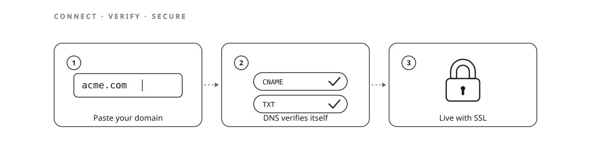
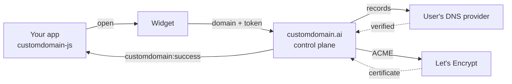

# CustomDomain™ SDK

The browser SDK that lets your SaaS users connect their own domain.

**Status:** Maintained · v0.5.1 · TypeScript · published to npm with provenance

[](https://github.com/CUSTOM-DOMAIN-APP/customdomain-sdk/actions/workflows/ci.yml)
[](https://www.npmjs.com/package/customdomain-js)
[](https://www.npmjs.com/package/@customdomain/react)
[](https://docs.customdomain.ai/docs/widget-sdk/overview)
[](./LICENSE)

[Website](https://customdomain.ai) · [Docs](https://docs.customdomain.ai/docs) · [Console](https://app.customdomain.ai) · [Widget and SDK reference](https://docs.customdomain.ai/docs/widget-sdk/reference) · [Releases](https://github.com/CUSTOM-DOMAIN-APP/customdomain-sdk/releases) · [Changelog](./CHANGELOG.md)

|  |  |
|---|---|
| **What it is** | Browser SDK and React bindings for the CustomDomain™ connect flow |
| **Who it's for** | SaaS teams whose users want `acme.com`, not `acme.yourapp.com` |
| **Live at** | [customdomain.ai](https://customdomain.ai) · docs at [docs.customdomain.ai/docs](https://docs.customdomain.ai/docs) |
| **Stack** | TypeScript · pnpm workspace · `customdomain-js` ships zero runtime dependencies |
| **Status** | Maintained · `customdomain-js` and `@customdomain/react` both at **0.5.1** on npm · every pull request builds the real bundle and drives it through headless Chromium |

This repository is the client half of [CustomDomain™](https://customdomain.ai): two npm packages
your application installs, plus the widget they open. Your app calls one function; the user pastes
a domain; DNS records, ownership verification and TLS certificates are handled by the control
plane. The backend, the edge and the certificate machinery live in a separate private repository.

## Why this exists

Letting customers bring their own domain is one of the highest-leverage features a SaaS product
can ship: it is what turns "powered by us" into the customer's own brand. It is also a swamp.
Every DNS provider exposes a different write API, or none. Root domains cannot hold a `CNAME`
([RFC 1034](https://datatracker.ietf.org/doc/html/rfc1034)), so half the internet's advice is
wrong for half of your users. Certificates have to be issued on demand and renewed forever. And
the failure mode is not an exception in your logs; it is a support ticket that says
"it still says pending."

CustomDomain™ turns that into a payment-method-shaped interaction: paste the domain, and either
the provider is authorized in one click or the widget shows the exact records and watches for
them. Of the 63 DNS and registrar providers catalogued today, 25 have an automatic write path;
the rest use a guided manual flow with automatic verification. Those counts come from a live
endpoint, and the Quickstart below shows you how to read it yourself.



## Install

```sh
npm install customdomain-js          # framework agnostic
npm install @customdomain/react      # React hooks and components
```

Or skip the build step entirely and load the hosted bundle, which is always current:

```html
<script src="https://app.customdomain.ai/widget-assets/customdomain-sdk.js"></script>
```

## Quickstart

```js
import { customdomain } from "customdomain-js";

customdomain.open({
  applicationId: "app_123",
  token: TOKEN_FROM_YOUR_SERVER, // minted server side; never ship an API key to the browser
  getToken: fetchFreshTokenFromYourServer, // optional: keeps long manual setups alive
});

window.addEventListener("customdomain:success", (e) => {
  console.log("connected:", e.detail.domain); // e.g. "acme.com"
});
```

Check the live provider census the numbers above come from:

```sh
curl -s https://api.customdomain.ai/v1/providers/census | head -c 200
```

## What it does

- **Opens the connect widget.** `customdomain.open(config)` mounts it in a sandboxed iframe, themed and localized.
- **Detects the provider and writes the records.** One-click authorization, a scoped provider API token, or [Domain Connect](https://www.domainconnect.org), with a guided manual path as the fallback.
- **Verifies ownership without a separate challenge step.** Control is proven by the rail that writes the DNS, or by the records appearing in authoritative DNS.
- **Handles root domains.** `wwwRedirect` connects the root and `www` and redirects the root, connects the root alone, or lets the user choose.
- **Streams progress to your app.** `customdomain:success`, `:step`, `:close`, `:error`, `:fallback`, `:purchase` and `:shared` events, plus `checkDomain()` and `checkRecords()` if you want to drive your own UI.
- **White-labels.** Colors, fonts, copy, locale and logo, so the flow reads as part of your product.

## How it's organized

```text
.
├── packages/sdk/         # customdomain-js: window.customdomain, framework agnostic
├── packages/react/       # @customdomain/react: hooks and components over the SDK
├── packages/widget/      # the widget UI used by CI's browser simulation (private, never published)
├── scripts/              # verify-release.sh (npm serves what this repo says) · release-notes.sh
├── llms.txt              # machine-readable index of this repo, for agents
└── .github/workflows/    # ci · release (tag driven, npm provenance) · sdk-drift (weekly)
```

Entry point: [`packages/sdk/src/index.ts`](packages/sdk/src/index.ts). Per-package APIs:
[`packages/sdk/README.md`](packages/sdk/README.md) · [`packages/react/README.md`](packages/react/README.md).



The SDK never talks to a DNS provider directly. It opens the widget, the widget talks to the
control plane, and your app listens for events.

## Develop

```sh
pnpm install
pnpm -r build        # react typechecks against the SDK's generated .d.ts, so build first
pnpm -r typecheck
pnpm sim             # drives the built widget through headless Chromium, 6 scenarios
```

CI runs all four on every pull request. The sim is a behavior gate, not a unit test: it walks
the OAuth journey, the manual fallback, locale and white-label theming, sequential multi-domain,
resume of a live domain, and share-link minting against a stub control plane with real wire shapes.

## Versioning and release

[Semantic Versioning](https://semver.org/). The two published packages move in lockstep and share
one [CHANGELOG.md](./CHANGELOG.md). Every published version has a `vX.Y.Z` tag and a
[GitHub release](https://github.com/CUSTOM-DOMAIN-APP/customdomain-sdk/releases) whose notes are
that version's CHANGELOG entry.

To release: sync the source from the product monorepo, bump both `package.json` files, add the
CHANGELOG section, merge, then push a `vX.Y.Z` tag. `release.yml` publishes both packages with npm
provenance, runs `scripts/verify-release.sh` against the live registry, and only then creates the
GitHub release. A separate weekly `sdk-drift` job compares this repo against the registry, because
a release that silently never fires produces no failing check anywhere else.

## Known limitations

- `@customdomain/widget` is `private: true` and served hosted from app.customdomain.ai. You cannot self-host that bundle, and the copy here exists for CI's browser simulation.
- 38 of the 63 catalogued providers have no usable delegated write API, so their users get the guided manual flow. Verified against `GET https://api.customdomain.ai/v1/providers/census` on 2026-09-26: 63 catalogued, 17 provider API, 6 OAuth, 2 Domain Connect, 38 manual.
- Widget tokens must be minted by your server. There is no browser-safe API key, by design.

## Related

- [docs](https://github.com/CUSTOM-DOMAIN-APP/docs): source of [docs.customdomain.ai](https://docs.customdomain.ai/docs)
- [customdomain-mcp](https://github.com/CUSTOM-DOMAIN-APP/customdomain-mcp): the hosted MCP server for AI agents
- [custom-domain-checks](https://github.com/CUSTOM-DOMAIN-APP/custom-domain-checks): a GitHub App for continuous DNS and TLS health checks
- [awesome-custom-domains](https://github.com/CUSTOM-DOMAIN-APP/awesome-custom-domains): the map of the whole space, including the alternatives

## Support

- **Docs:** [docs.customdomain.ai](https://docs.customdomain.ai/docs)
- **Questions and ideas:** [GitHub Discussions](https://github.com/CUSTOM-DOMAIN-APP/docs/discussions)
- **Bugs and corrections:** [open an issue](https://github.com/CUSTOM-DOMAIN-APP/customdomain-sdk/issues) on this repository
- **Service status:** [status.customdomain.ai](https://status.customdomain.ai)
- **Account and billing:** connect@customdomain.ai
- **Security:** report privately to security@customdomain.ai, never in a public issue. Policy: [app.customdomain.ai/security](https://app.customdomain.ai/security)

## License

[Apache-2.0](./LICENSE). CustomDomain™ is a product of EverJust Company.
